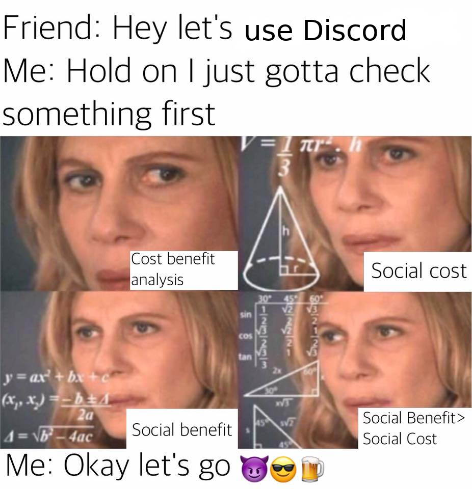

# Fractalization Process

## Introduction

**The importance of having a process**

> We overestimate the event and underestimate the process. Every fulfilled dream occurred because of dedication to the process.
>
> – John C. Maxwell

A well-structured and mature process is one of the keys to the success of any project. And although each DAO is a World in itself, there are numerous patterns that over time we have been developing and assimilating, finding these recurring paths to help us achieve uniquely different results for each D2D interaction we embark on.

We are not going to talk about a single process. It will not be a one-off discourse either. In reality, since each DAO has its own peculiarities, depending on the D2D dynamics, the three scenarios that can be highlighted are:

* DAO **Ambassadorship** opening
* **SubDAO** recognition
* **InterDAO** proposal

## **DAO Ambassadorship opening**

Some specific members of a DAO would like to consolidate a bridge between their DAO and the receiverDAO through them rather than full, open, D2D participation. Considering the massive complexities DAOs are facing, this can be a wise temporary choice. The only thing to do is to confirm that their DAO consents to be partially represented by those members.

## **SubDAO recognition**

When starting a DAO from scratch, but inside the receiverDAO, the process will be the same as applying for a interDAO status. With the particularity that we will have to identify the threshold in which an internal experiment grows big enough to hold reputation on its own. In the next section, we will define the overall process.

## **InterDAO proposal**

When a DAO requests to join another DAO. This scenario is the most complete, so it is the one we're going to develop here. It requires an overview and consists of 3 phases.

* A receiverDAO wants to **onboard** new members, including other DAOs
* An applicantDAO wants to **apply** for membership in a receiverDAO
* The actual fractalizing **voting**

### 1. Preparation

Every fractalization is born from specific needs. But it is very common that DAO citizens themselves do not know exactly what they want or why they should join together. As members of the receiverDAO, it is very important to make sure the applicantDAO gets to know us before applying for reputation, so that we transmit with clarity our culture and our approach to the work that we do, thus their DAO members understand the differential value that we carry.

**This preparation can be given in several ways:**

* **We orient the applicantDAO.** Its members will likely approach us with a preconceived idea about the process. ****When they start working with us, we present them a holistic view of our DAO, learning from our heuristics.
* **We onboard members of the applicantDAO.** A very important value that sets us apart ****is the flexibility, open experimentation and participation. Accepting a few members of the applicantDAO and orienting them prior to a fractalization allows for more seamless integration between us.

**Why is it so important?**

* **Sharing vision and culture.** It is very important for your DAO to know what they are going to get from us and what they are not.
* **Avoid approaches that do not fit in.** It is better to not approve a request that is not aligned with our values and mission. Then, either help them get there or refer to other DAOs or even other organizational structures. It improves the landscape, it is being honest with them and it allows us to focus where we really can make a difference.
* **Improve the value of our work.** By conveying the process and details of other encounters, we enable the applicantDAO to better understand the ecosystem complexity, which improves their ability to understand contribute with what we do.


Each DAO should be responsible for offering proper documentation and orientation about itself. The exercise to produce such assets can be like a gift that keeps giving.


### **1.1 Agreements**

After being brought up to speed about the DAO, it's time to learn how to join it. 

The agreements phase allows us to establish a framework for our work. It should be a series of clear specifications that must be feasible to follow but also easy to track. This way we can extract all the necessary information to help KISS \(Keep It Simple and Sane\) down the road. The conclusions in this phase will then be shared as one more documentation. Only in this way can we eliminate such expressions as "[FUBAR](https://www.thefreedictionary.com/fubar)" from the vocabulary of DAO2DAO relations.

With any quality proposal, whether it is product, branding, or some other type of contract, it begins with agreements. It is the most important part of the whole process. The key is to define the relation we are considering. Because if we fail to define boundaries, we may never build a healthy ecosystem. There are many ways to discover and communicate boundaries. The understanding phase starts from day one.

This is also the time to prepare at the technical level. If the applicantDAO already exists, how is it going to connect with the receiver, will the address used be kept long term? Decisions from this preparation should be mentioned in the proposal or its supporting material while shared on public channels. This way they can see the progress and provide feedback throughout the process.


The main difference between orientation and agreements is that while one explains vision, tools, past events, the other is about rights and responsibilities.


Some agreements may include:

* **The applicantDAO**:
  * should read all the basic documentation about the receiverDAO
    * and from there agree with core values and non-negotiable practices
  *  must abide to a reputation cap policy
    * limiting the total amount of reputation that any member is allowed to hold, including derivative reputation \(more about drep [here](knowledge-management.md)\)
  * They must agree to use a specific setup of a multisig and/or dapp \(Alchemy, Gnosis safe\) in order to participate in the voting process
  * has the right to vote on proposals as they see fit and are themselves free to create proposals at their discretion.

### 2. Signaling

After the applicantDAO screens the receiverDAO, learning of its value proposition, its principles and mission, to understand its core. Then it should signal back to the receiverDAO about itself, offering the same courtesy from the preparation phase. After signaling and incorporating feedbacks, everything is gathered in this stage and finally a proposal can be made.

This point is especially crucial. **Laying a good foundation** establishes a healthy relationship with the receiverDAO and helps to arrive at informed decisions in an agile manner. 

### 2.1 Presentation\(s\)

One of the most common ways to begin to understand a project is through a presentation. That is if there had not already been one before the proposal. There are a variety of formats. In its most common form, it is nothing more than a document detailing the DAO's request for reputation and a basic introduction. 

But it can be much more than that. In our case, [multiple templates](templates/) allow us to test what format works better for both signalling and screening, and anticipate potential problems or benefits that each fractalization can bring. Basically, we want to extract as much information as possible. It is about asking the right questions and making good presentations with the right answers during this phase.

<table>
  <thead>
    <tr>
      <th style="text-align:left"></th>
      <th style="text-align:left">Example of addressable key points:</th>
    </tr>
  </thead>
  <tbody>
    <tr>
      <td style="text-align:left"><b>Who?</b>
      </td>
      <td style="text-align:left">
        

        <ul>
          <li>Who is this incoming DAO? Which of their members already belong to genDAO?</li>
        </ul>
      </td>
    </tr>
    <tr>
      <td style="text-align:left"><b>What?</b>
      </td>
      <td style="text-align:left">
        

        <ul>
          <li>What&#x2019;s the purpose of their DAO? And, if applicable, their business
            model/DAO model?</li>
        </ul>
      </td>
    </tr>
    <tr>
      <td style="text-align:left"><b>When?</b>
      </td>
      <td style="text-align:left">
        

        <ul>
          <li>What is the DAO&#x2019;s internal roadmap? And what is their roadmap relative
            to genDAO?</li>
        </ul>
      </td>
    </tr>
    <tr>
      <td style="text-align:left"><b>Where</b>
      </td>
      <td style="text-align:left">
        

        <ul>
          <li>Which jurisdictions are involved, which corners of the cyberspace it touches</li>
        </ul>
      </td>
    </tr>
    <tr>
      <td style="text-align:left"><b>Why</b>
      </td>
      <td style="text-align:left">
        

        <ul>
          <li>Why join this DAO and why as another DAO and not differently?</li>
        </ul>
      </td>
    </tr>
    <tr>
      <td style="text-align:left"><b>How</b>
      </td>
      <td style="text-align:left">
        

        <ul>
          <li>How participation takes place and in what ways it involves the status
            of being a DAO?</li>
        </ul>
      </td>
    </tr>
  </tbody>
</table>


This “presentation” could be a forum thread, a complete AMA, or a pre-recorded video, or a live video presentation, a pitch deck or even a simple pre-proposal document.


### **3. Proposal**

The fractalizations are born from the DAOs' needs. DAO citizens reach out to each other and after introductions are made the receiverDAO may present its needs and requirements through an **Orientation**, be it with documentation, onboarding session or both. ****Based on this, a **proposal** can be formalized, materializing compatible ideas, objectives and agreements that the applicantDAO can offer to provide value to the ecosystem.


More mature DAOs will most likely have extensive documentation about itself while preDAOs might produce information on demand. 


**The proposal should contain:**

* Resources requested \(tokens, reputation\)
* About the proposers, with comms channels
* A detailed description of the applicantDAO
* When applicable, a roadmap with estimate of the stages deadlines 
* How the fractalization helps promote the receiverDAO's objectives
* A rationale for the resources requested 
* Conditions for the deliverables, if any.
* Materials, documentation, external references to support above points
* On certain occasions, examples of other proposals.

Although accepting or rejecting a proposal may make a priori seem like a rational decision, much of it is based on the emotional. For this reason, we must never neglect the detail, narrative, and graphics quality of our proposals: it must be a reflection of what it's being offering and be clearly aligned with the identity and culture of our study.

Once the proposal has been approved, where the services are to be carried out and the objectives to be achieved have been defined, they are documented in the proper channels and shared in the main channels of communication.


In a final note, after a successful voting, a series of checks and balances should take place according to the previous agreements - e.g. against reputation exploits. Consistent, decentralized accountability practices are highly recommended, like an [Accountability Task Force](https://ecosystem.daoincubator.org/atf/) \(ATF\) or a [Decentralized Accountability Network](https://docs.google.com/document/d/1LLdsYCQi2fDiV2svFEzZGgsYn81cLlcfQ3kE_1OrKwo/edit?usp=sharing) \(DANk\)




## Meme

