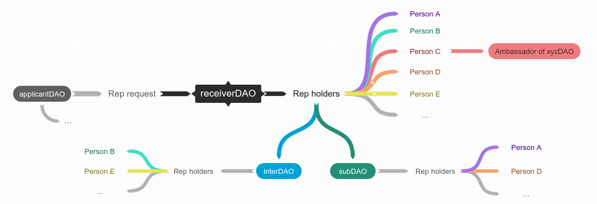
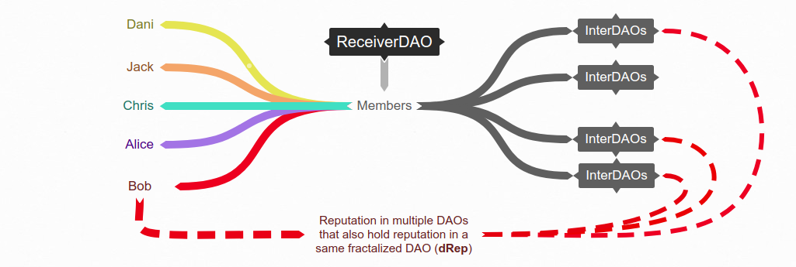
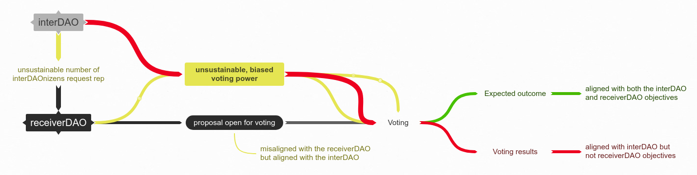
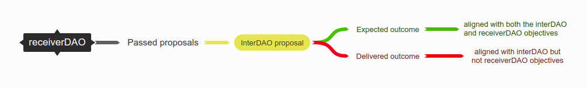

# Knowledge Management

The fractalization of DAOs has several implications on the topology of the DAO space, in the sense that a series of new DAO shapes and relations become possible once DAOs can join DAOs. In this section, we’ve taken a stab at defining these new forms, some related concepts and we will share our basic conceptualization at different levels. Finally we will take it further by attempting at illustrating some of them. 


A brief comment about the limitations of systematics: A guy once tweeted he dreamed being interviewed about taxonomy, “Are hotdogs sandwiches?” he was asked. “They’re an edge case that prove how limited our taxonomical models are.”


## Fractalizing

When a DAO accepts another DAO as its member, usually by reputation granting. There are 2 main ways that a DAO can fractalize: one is the emergence of a DAO inside another DAO \(subDAO\), and the other is for one DAO to grant voting power to another DAO \(interDAO\).‌

From the multiple and sometimes confusing dynamics that fractalizing brings, we work a nomenclature around their objectives. We distinguish five types of DAO according to their intentions: **subDAO**, **interDAO**, **applicantDAO**, **receiverDAO** and **preDAO**.

### subDAO‌

The literal fractal DAO; one which exists inside a DAO, such that all of its operations are contained within that receiverDAO.‌

### interDAO

A DAO which holds voting power in receiverDAO but is not a subDAO of the receiverDAO, i.e. it also operates outside of it.‌

### applicantDAO

A candidate subDAO or interDAO in the process of requesting membership - usually in the form of reputation.

### **receiverDAO**

A "parent" or "granter" DAO in the process of deliberating about the recognizing a subDAO or interDAO as its member, usually by voting on a reputation request.

## preDAO

A preDAO is, quite simply, an aspirational DAO -- a group of individuals who have organized themselves around the task of building a DAO, but have not yet achieved some arbitrary critical mass of decentralization and autonomy. It also references to the ancient Taoist concept of “[Pre Heaven](https://www.tinyatdragon.com/blogs/spiritual/pre-heaven-and-post-heaven-in-taoism)” - as a space of potentiality.‌

## DAO ambassadorship‌

Some specific members of a DAO would like to consolidate a bridge between their DAO and the receiverDAO through themselves rather than ful D2D participation as interDAO. Considering the massive complexities DAOs are facing, this can be a wise temporary choice.

## xyzDAOnizen

An \(ugly\) contraption for "Citizen/member of the xyzDAO" - e.g. dxDAOnizen, memeDAOnizen.

## New Attack Vectors

### Derivative reputation \(dRep\) 

A measure of the amount of reputation power that individuals wield in a DAO as a result of belonging to an interDAO that’s a member of it.‌ If a person accumulates reputation in multiple fractalized DAOs there is a possibility of an unhealthy accumulation of reputation that could output unbalanced voting power.

**Mitigation:** instead of attempting to track each person's reputation we'd rather focus on checking if the interDAOs have a healthy distribution of reputation among its members. As long as all DAOs that participate in a receiverDAO have a sufficiently diluted reputation distribution, dRep shouldn't be a real issue. 

### Swarming 

A new attack vector from D2D interactions: if too many members of one or more interDAO join a receiverDAO, at some point it tips the scale, allowing for biased, unbalanced voting power in detriment of other interDAOs and even the receiverDAO itself.

**Mitigation:** "trusted setup", when a DAO first decides to fractalize, it should aim at onboarding as many "trusted" or simply "healthy" DAOs as possible, granting a much bigger threshold against such risk. 

### Trojan Horse

When an agreement \(usually from a proposal\) is followed or delivered differently from what was proposed and eventually benefits an interDAO in detriment of the receiverDAO. 

**Mitigation**: active, healthy, decentralized accountability practices.

## Meme

