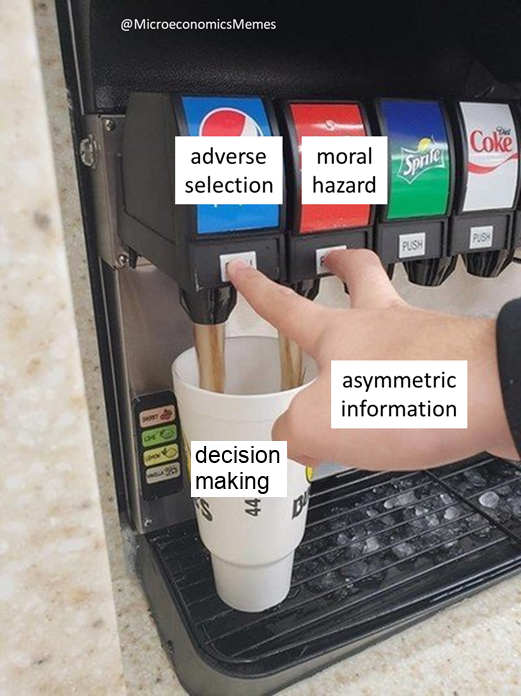

# Open Discussions

## Problem-Solution Proposition

_So, to situate this discussion in the context of the larger picture, why are we concerning ourselves with establishing a procedure for fractalizing genDAO?_

Collaboration at scale gravitates around entities.  However, in the current DAO space, interactions between DAOs often take the form of initiatives by specific members.  In other words, the processes by which individual DAOs translate member sentiment into governance action do not yet accommodate interactions between DAOs.  

With genDAO positioned to assume the role of DAOstack ecosystem coordinator, how can we extend this efficiency beyond self-contained DAOs, so that the ecosystem can develop in a more dynamic and scalable way?  To state the problem in another way, a lack of standardization in the fractalization process could lead to a number of woes, including information asymmetries that threaten to expose us to [adverse selection and even moral-hazard](https://www.investopedia.com/ask/answers/042415/what-difference-between-moral-hazard-and-adverse-selection.asp).  

To truly open up the possibilities of fractalized DAOs, we need custom tailored onramps that DAOs can use to “plug into” other DAOs.  Certain basic elements of a “minimum viable fractalization” procedure must be defined so that would-be interDAOs are not forced to get too creative or engage in too much guesswork regarding the onboarding process. Besides the actual procedure, a broader and more comprehensive nomenclature is needed, together with updated checks and balances around reputation hold.

## External References

* [DAO to DAO Reputation Sharing ](https://daotalk.org/t/dao-to-dao-reputation-sharing-models/342)- Rawson, Weller \(2018\)
* [Scalable collaboration using network of small DAOs connected by bounties](https://daotalk.org/t/scalable-collaboration-using-network-of-small-daos-connected-by-bounties/497) - Zefram Lou
* [How does a DAO go fractal? D2D interaction, onboarding](https://daotalk.org/t/how-does-a-dao-go-fractal-d2d-interaction-onboarding/571) - open forum discussion
* [DAO Landscape mapping](%20https://daolandscape.today/) - v0.1 report, from independent team of researchers
* [DAOspace](https://www.daospace.org) - mapping, Eric Arsenault

### Previous Fractalization

* [dxDAO](https://alchemy.daostack.io/dao/0x294f999356ed03347c7a23bcbcf8d33fa41dc830/proposal/0x91e5698c4135010c2d5fc9f99fcff88450fcc45596f8baff3666fa7cd855a00f)
* [dOrg](https://alchemy.daostack.io/dao/0x294f999356ed03347c7a23bcbcf8d33fa41dc830/proposal/0xf6f19ba36227d6b83c68709d11d74f7f46709edd192865eb2f219f6ea245f944)
* [PragueDAO](https://alchemy.daostack.io/dao/0x294f999356ed03347c7a23bcbcf8d33fa41dc830/proposal/0xaebc8d96eb20025fe429bdcea60edaac8febe1d6503a3f4e2cada2cb2afbaf33)
* [CuraDAO](https://alchemy.daostack.io/dao/0x294f999356ed03347c7a23bcbcf8d33fa41dc830/proposal/0xab0abf6fe23e9a2586a8352eae997fd590b601b1d53a4b1e23c2084953ac8f06)

## Meme

