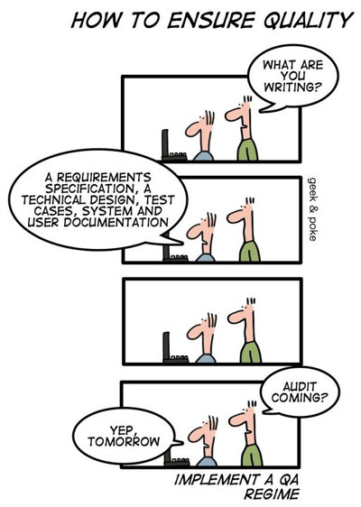

# Templates

In this section we will go over the templates we use and and how we implement them throughout our fractalization process. We talk about the purpose of each template and how we work with them in a way that helps us carry things in an open and transparent way.

## Formal Proposal

Even though a proposal can be documented in almost any way, some specific templates have approached the status of Schelling point, facilitating both signaling and screening of the process. 

Previously on genDAO, a proposal successfully validated this list of templates for proposals aiming to be submitted in Alchemy compatible DAOs. By Pedro Parrachia and Stratis Karadakis.



## Form

A form can be a great asset for any DAO considering opening itself for fractalization. Besides clearer topics of interest, in the long term a single spreadsheet with most or all interDAOs answers can be a great asset for the ecosystem.

What follows bellow is a long list of questions that can be freely answered or skipped. From raison d'être, to business plan, to partners and beyond. 



## DAO Pitch Deck

As a great supporting format, presentations have the power to help synthesize and condense information in a way that greatly increases engagement and awareness. Just don't forget to add some memes. This template was developed by Eric Arsenault as part of the DMO.



## [DAO Design Canvas](https://docs.google.com/document/d/1erwDj5Xr4S1uPeeNdKZE1A2Mw-gla-0g5SxQZ-AWc90/edit)

DAO Design Canvas \(aka DAOkitchen\)A kit for understanding and prototyping DAO Pilots in a Workshop / Sprint scenario that delivers highly qualified leads & user testing data. Thanks to its molecularity it can also be used to describe how an applicantDAO works. By Felipe Duarte.

From the its documentation:

* DAO building methodology template 
* Script for facilitated workshop
* Ready to use custom design assets 
* Clear, canvanized steps
* Open Source and replicable by all 
* End result is a brief for developers
* Delivers consistent validation data



## [Video Presentation](https://docs.google.com/document/d/1oilPFlKq13So82LxYouvmoiNNVH1VE7rKfwCsaTLyLA/edit?usp=sharing)

Video presentations are a chance to introduce your organization in a way that is informative, engaging and much more flexible. DAO citizens like to make informed decisions; we appreciate it when people take the time to provide extra information, and would love it if you’d signal your intentions in multiple ways.

In the document bellow we present some starting guidelines for those interested in presenting their DAOs using a multimedia approach.


It can be both a pre-recorded video and/or a live stream in a community call.




## Meme

